# Archives of Elites and Generated Scenes

## Representation-Based Behavior Characteristics

    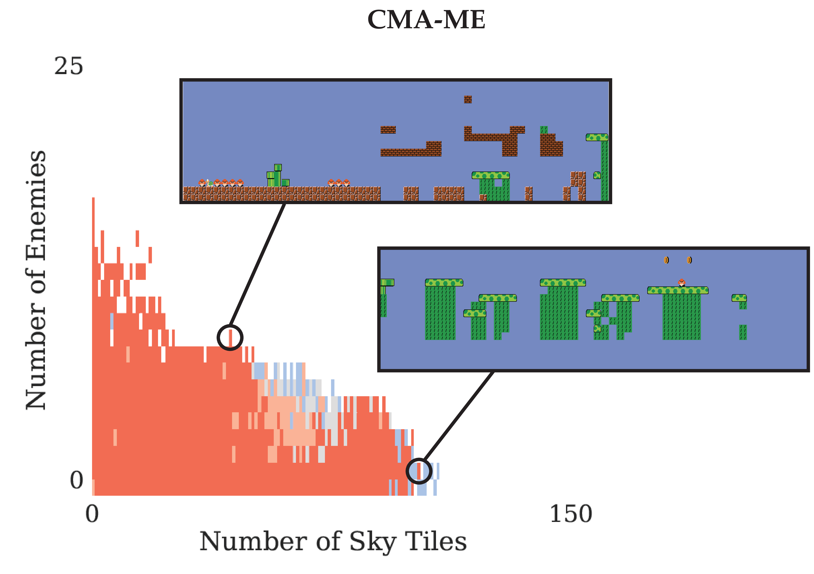 

<b> Archives of Elites and Example Levels on Representation-Based BC using CMA-ME</b>

 

<table border="0">
  <tr>
    <td align="center" >Large Number of High Tile</td>
    <td align="center">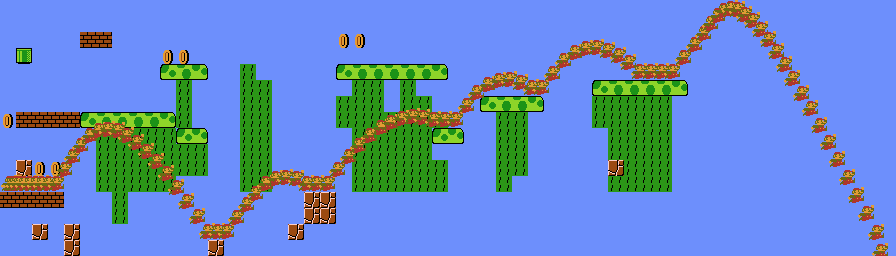</td>
    <td align="center">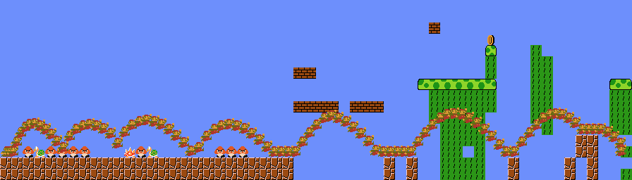</td>
  </tr>
  <tr>
    <td align="center">Small Number of High Tile</td>
    <td align="center">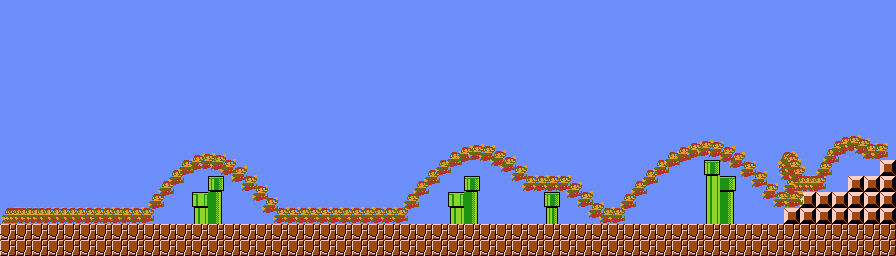</td>
    <td align="center">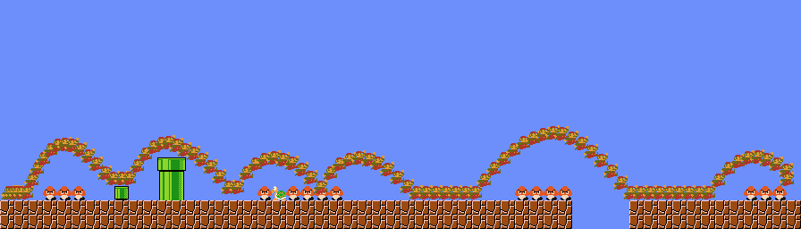</td>
  </tr>
  <tr>
    <td></td>
    <td align="center">Small Number of Enemies</td>
    <td align="center">Large Number of Enemies</td>
  </tr>
</table>

<b> Representative Generated Levels using CMA-ME for Representation-Based BC</b>

 

## KL-Divergence Behavior Characterstics

    <iframe src="https://drive.google.com/file/d/1bj9F8TB4srzHU2rKt7OgTBE2E4KUzsoa/preview" width="640" height="240"></iframe>

    <iframe src="https://drive.google.com/file/d/1dAP_zvqUTLBRZrfWAwowihes5kirNTub/preview" width="640" height="240"></iframe>

<b> The Two Groundtruth Levels Used for KLBC Evaluations (Upper: Level 1, Lower: Level 2)</b>

 

    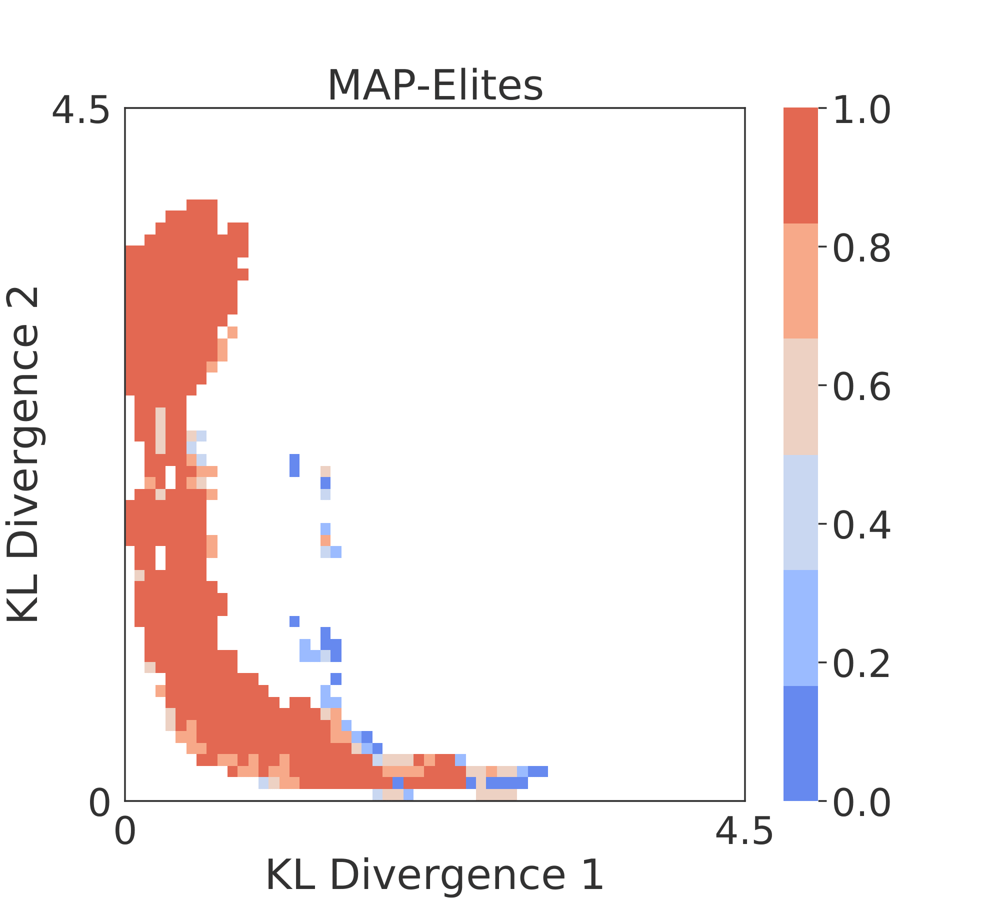 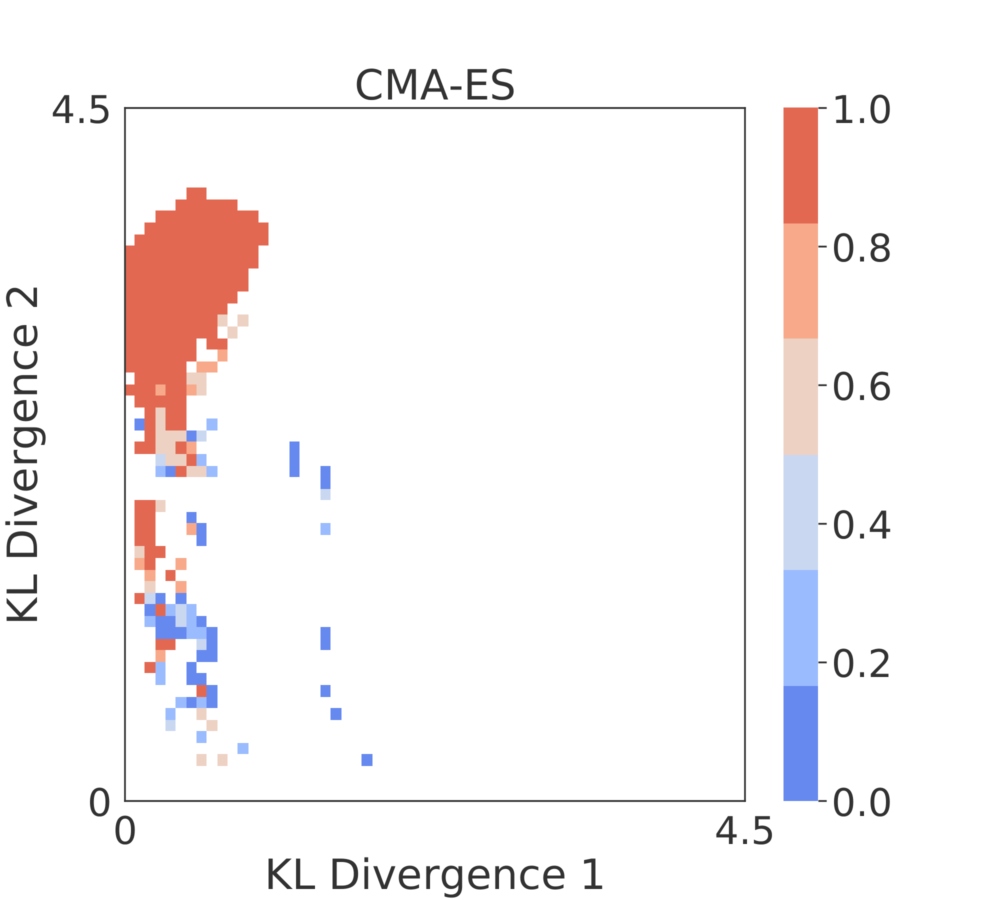 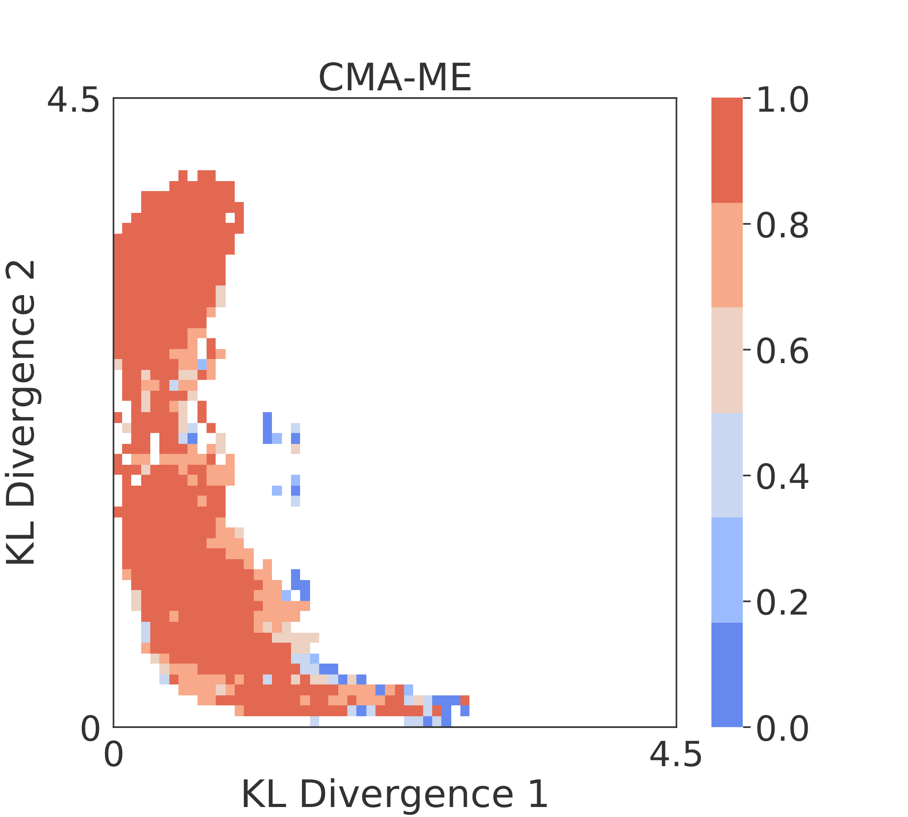

<b> Archives of Elites on KL-Divergence BC using Different Algorithms</b>

 

<table border="0">
  <tr>
    <td align="center" >Large KL-1</td>
    <td align="center">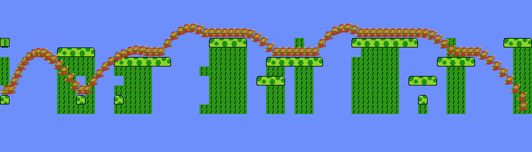</td>
    <td align="center">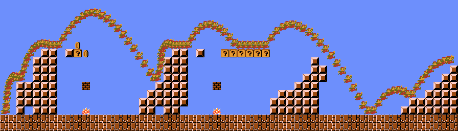</td>
  </tr>
  <tr>
    <td align="center">Small KL-1</td>
    <td align="center">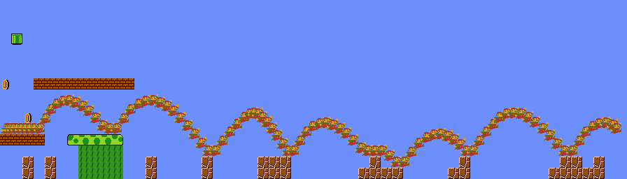</td>
    <td align="center">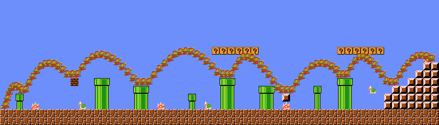</td>
  </tr>
  <tr>
    <td></td>
    <td align="center">Small KL-2</td>
    <td align="center">Large KL-2</td>
  </tr>
</table>

<b> Representative Generated Levels using CMA-ME for KL-BC</b>

 

## Agent-Based Behavior Characteristics

    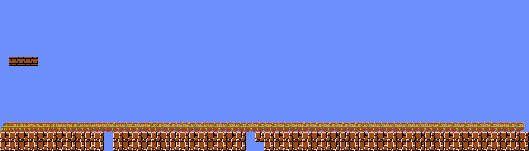 &emsp; 

<b> Generated Levels with Minimum (Left) and Maximum (Right) Sum Value of the 8 Agent-Based BCs</b>

 

# User Study Levels

## Representation-Based Behavior Characteristics

<a> <iframe src="https://drive.google.com/file/d/19ZtnZSz8IBsHlLpDMTZSb2Fhqx6ZDLEm/preview" allowfullscreen="allowfullscreen" width="320" height="240" frameborder="0"></iframe> </a>
<a><iframe src="https://drive.google.com/file/d/1Mi6iD7TbRs1pC-FpTyiyy8O0bnoTao7m/preview" width="480" height="240"></iframe> </a>

 <b>0 Upper Tiles, 11 Enemies</b> 

 

<a> <iframe src="https://drive.google.com/file/d/1OMfTgzGDpN5jYTTpPxvAQ9Qyci_Gfmow/preview" allowfullscreen="allowfullscreen" width="320" height="240" frameborder="0"></iframe> </a>
<a><iframe src="https://drive.google.com/file/d/1U3kKs4_aH1uZAtJeJjnkmeJZwO7v7zbS/preview" width="480" height="240"></iframe> </a>

 <b>10 Upper Tiles, 2 Enemies</b> 

 

<a> <iframe src="https://drive.google.com/file/d/1smbddNg93e0UBJqYVLXpnttiI_B1mduc/preview" allowfullscreen="allowfullscreen" width="320" height="240" frameborder="0"></iframe> </a>
<a><iframe src="https://drive.google.com/file/d/1D3RqIzGAXYDq6omNt0DFxtCBF8_S2pzZ/preview" width="480" height="240"></iframe> </a>

 <b>20 Upper Tiles, 14 Enemies</b> 

 

<a> <iframe src="https://drive.google.com/file/d/1SKga8f61pbLIO3GCIESXdmWZRsyaUAsM/preview" allowfullscreen="allowfullscreen" width="320" height="240" frameborder="0"></iframe> </a>
<a><iframe src="https://drive.google.com/file/d/1AYU6Bn3pMI4o6Ps8Sa8mLj1qWSjVXwJs/preview" width="480" height="240"></iframe> </a>

 <b>23 Upper Tiles, 0 Enemies</b> 

 

<a> <iframe src="https://drive.google.com/file/d/1vrfdEFan9sj9i7YjPjk04jtt_N2QT4Hi/preview" allowfullscreen="allowfullscreen" width="320" height="240" frameborder="0"></iframe> </a>
<a><iframe src="https://drive.google.com/file/d/1BOGBgYMTj63csA1PT2RiAJ5Jv_PwrHgf/preview" width="480" height="240"></iframe> </a>

 <b>27 Upper Tiles, 9 Enemies</b> 

 

<a> <iframe src="https://drive.google.com/file/d/1NezhMeH9yyxC765zcs8ycIGfhgNXExyG/preview" allowfullscreen="allowfullscreen" width="320" height="240" frameborder="0"></iframe> </a>
<a><iframe src="https://drive.google.com/file/d/1Ohil8eTyzl3QE_IANx3FQjl6pZsfJJ8l/preview" width="480" height="240"></iframe> </a>

 <b>32 Upper Tiles, 4 Enemies</b> 

 

<a> <iframe src="https://drive.google.com/file/d/1mQlh8xsagqCRwZJ1OuzC9B7uIIqMJjig/preview" allowfullscreen="allowfullscreen" width="320" height="240" frameborder="0"></iframe> </a>
<a><iframe src="https://drive.google.com/file/d/1rOpXkrXgxAtpaoQIo9KCJowChocS8cQB/preview" width="480" height="240"></iframe> </a>

 <b>45 Upper Tiles, 3 Enemies</b> 

 

<a> <iframe src="https://drive.google.com/file/d/1JdRVJQtHO7CLitmRobqpVP_Q4q9Ld63B/preview" allowfullscreen="allowfullscreen" width="320" height="240" frameborder="0"></iframe> </a>
<a><iframe src="https://drive.google.com/file/d/1DV8Z86SlUZmUCAmkr0H_fLgrR9uZtgIr/preview" width="480" height="240"></iframe> </a>

 <b>53 Upper Tiles, 6 Enemies</b> 

 

<a> <iframe src="https://drive.google.com/file/d/1ndcL9DdR6DTAZg58CIWQjyL6fHikXwUB/preview" allowfullscreen="allowfullscreen" width="320" height="240" frameborder="0"></iframe> </a>
<a><iframe src="https://drive.google.com/file/d/1iozDTJ1RYcXulD81-UVFC-J37GmLCkwv/preview" width="480" height="240"></iframe> </a>

 <b>78 Upper Tiles, 1 Enemies</b> 

 

<a> <iframe src="https://drive.google.com/file/d/13n0lxlHYd_EJAS_1JC-DMfzGQN0oG6hK/preview" allowfullscreen="allowfullscreen" width="320" height="240" frameborder="0"></iframe> </a>
<a><iframe src="https://drive.google.com/file/d/1ldeVW-wJuGq7p1hLU8OiRTbqXby6KHdB/preview" width="480" height="240"></iframe> </a>

 <b>93 Upper Tiles, 3 Enemies</b> 

 

## KL-Divergence Behavior Characteristics

 

<a> <iframe src="https://drive.google.com/file/d/1OIR4ZTAXqiP8W5ME82lOy6DET6iNNp8r/preview" width="320" height="240" frameborder="0"></iframe> </a>
<a><iframe src="https://drive.google.com/file/d/1pK7w4em1C1PuB7obqg-9klEVgHuy6A_i/preview" width="480" height="240"></iframe> </a>

 <b>KL-Divergence: 0.06, 3.47</b> 

  
  
 

<a> <iframe src="https://drive.google.com/file/d/1bsjc394HXml7ypwma2zbxo7LYnzUR4zX/preview" allowfullscreen="allowfullscreen" width="320" height="240" frameborder="0"></iframe> </a>
<a><iframe src="https://drive.google.com/file/d/1ONeqRKF7Ap9MyjYRC_koPKCsjFExs8xW/preview" width="480" height="240"></iframe> </a>

 <b>KL-Divergence: 0.53, 1.95</b> 

  

 

<a> <iframe src="https://drive.google.com/file/d/1EkFAmh0ulNfc2V8mGbBSpEEMspYZnbTt/preview" allowfullscreen="allowfullscreen" width="320" height="240" frameborder="0"></iframe> </a>
<a><iframe src="https://drive.google.com/file/d/1LkkZ9edjojUg8_6dNGYiKwcjRwsglLnc/preview" width="480" height="240"></iframe> </a>

 <b>KL-Divergence: 0.55, 3.90</b> 
  
  
  
 

<a> <iframe src="https://drive.google.com/file/d/1RD212NrIuzdDLi6ngoqZmnLRS2_iGm23/preview" allowfullscreen="allowfullscreen" width="320" height="240" frameborder="0"></iframe> </a>
<a><iframe src="https://drive.google.com/file/d/13eHUveOtM5qmbKqVWnJ3ejMl9__qUWbl/preview" width="480" height="240"></iframe> </a>

 <b>KL-Divergence: 0.77, 1.17</b> 
    
  
  
 

<a> <iframe src="https://drive.google.com/file/d/1VDkUlsw6Gzxrbsz1GSYVeURjXYZ_chXw/preview" allowfullscreen="allowfullscreen" width="320" height="240" frameborder="0"></iframe> </a>
<a><iframe src="https://drive.google.com/file/d/1UCKpy06pVDMfbyNlG6YMEpBFSd2ts1og/preview" width="480" height="240"></iframe> </a>

 <b>KL-Divergence: 0.98, 0.74</b> 

  
  
 

<a> <iframe src="https://drive.google.com/file/d/1sYQnXhTDDyEZVKe66Qqemw-Md5PFMCFs/preview" allowfullscreen="allowfullscreen" width="320" height="240" frameborder="0"></iframe> </a>
<a><iframe src="https://drive.google.com/file/d/1Sn2uXND5PjZeq1l2yv1_0x7APMQ44MwB/preview" width="480" height="240"></iframe> </a>

 <b>KL-Divergence: 1.03, 3.73</b> 
  
  
  
 

<a> <iframe src="https://drive.google.com/file/d/1UciY-eCNRs3daDp5bA7apoBjDxrzdGvi/preview" allowfullscreen="allowfullscreen" width="320" height="240" frameborder="0"></iframe> </a>
<a><iframe src="https://drive.google.com/file/d/1fa4J6R35jm8BdsAEhUAAbRVPYNP66Oeo/preview" width="480" height="240"></iframe> </a>

 <b>KL-Divergence: 1.12, 1.03</b> 
 
  
  
 

<a> <iframe src="https://drive.google.com/file/d/18NKmLMBFEV6IW7IqCH0KA-cdx8CoVReF/preview" allowfullscreen="allowfullscreen" width="320" height="240" frameborder="0"></iframe> </a>
<a><iframe src="https://drive.google.com/file/d/1wHaTa6Lh_RTkoO2Z0_IyGZwHzGhd_VJs/preview" width="480" height="240"></iframe> </a>

 <b>KL-Divergence: 1.24, 0.54</b> 
 
  
  
 

<a> <iframe src="https://drive.google.com/file/d/1uj05N0u0DrgwVdZXuJIdgftsv9sCN7QQ/preview" allowfullscreen="allowfullscreen" width="320" height="240" frameborder="0"></iframe> </a>
<a><iframe src="https://drive.google.com/file/d/1Ziu6y_SY9qogUeLCEbW4XfzJJKJmqS3O/preview" width="480" height="240"></iframe> </a>

 <b>KL-Divergence: 1.59, 0.25</b> 
 
  

 

<a> <iframe src="https://drive.google.com/file/d/1N1CkYOKrb7rgJptBFc5VvnEK8X5yTC2W/preview" allowfullscreen="allowfullscreen" width="320" height="240" frameborder="0"></iframe> </a>
<a><iframe src="https://drive.google.com/file/d/1jWTHOJWpdqcSp3TymT76iAdsiz-Ux-q7/preview" width="480" height="240"></iframe> </a>

 <b>KL-Divergence: 2.23, 0.21</b> 
 

